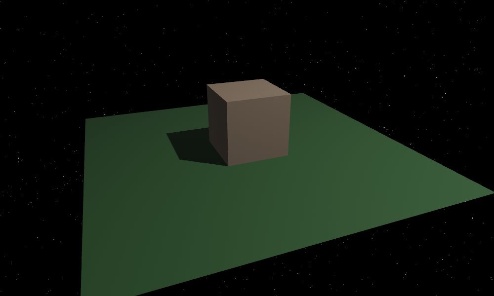

# bevy_starfield

[](https://crates.io/crates/bevy/0.10.0)
[](https://crates.io/crates/bevy_starfield)
[](https://crates.io/crates/bevy_starfield)
[](https://docs.rs/bevy_starfield/)


A procedural night sky plugin for the Bevy game engine.



## Minimal Example

```rust
use bevy::prelude::*;
use bevy_starfield::StarfieldPlugin;

fn main() {
    App::new()
        .add_plugins(DefaultPlugins)
        .add_plugin(StarfieldPlugin)
        .add_startup_system(setup)
        .run();
}

fn setup(mut commands: Commands) {
    commands.spawn(Camera3dBundle::default());
}
```

## License

bevy_starfield is dual-licensed under MIT and Apache-2.0. You may use it under either at your option.

## Credits

The star data included with this crate is sourced from the [Yale Bright Star Catalog](http://tdc-www.harvard.edu/catalogs/bsc5.html).